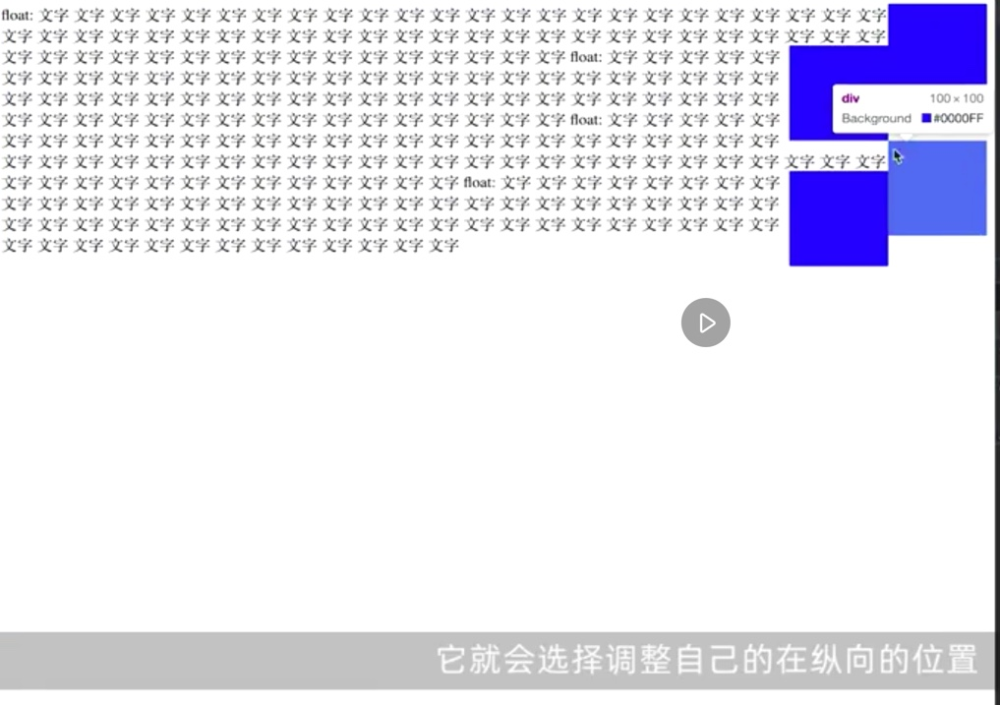
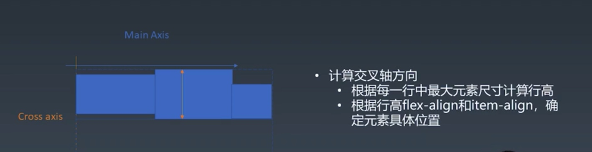

# 盒
盒 box 是排版和渲染的基本单位。

一个 element 可能生成多个盒。

tags 表示 element

盒模型
* content / padding / border / margin
* box-sizing: content-box / border-box

# 正常流
## 步骤
1. 收集盒与文字进行（flexbox 中只有盒，就算有文字，也是把文字装盒里再排）
2. 计算盒与文字在行中的排布
3. 计算行的排布

## IFC & BFC
* inline level formatting context：行内从左往右排
* block level formatting context： block 块从上往下排

# IFC 行级排布
## 行模型
### 重点的五条线
* line-top 当行高大于文字高度
* text-top 由字体大小 fontsize 决定，多种字体混排时取最大值
* base-line
* text-bottom
* line-bottom

sub sup 等

### 文字与盒混排
文字与盒混排时，行内盒的先后顺序、行内盒的尺寸都会影响 line-top line-bottom 的位置。

例如，盒撑高 line-top：

行内盒 line-block 的基线 base-line 是随着盒内文字变化的。
例如，没有文字时，盒的下边缘对齐基线。

有文字时，按盒内文字对齐基线；有多行文字时，按底下那行文字对齐基线。

所以，不建议行内盒使用基线对齐。可以使用 `vertical-align`:

* `vertical-align: top` 盒的上边与 line-top 对齐：

* `vertical-align: bottom` 盒的上边与 line-bottom 对齐：

* `vertical-align: middle` 盒的中心线与文字对齐：

* 另外，还可以和文字的上下线对齐 `vertical-align: text-bottom/text-top` ：

# BFC 块级排布
## 两个相关现象
### float & clear
float：脱离正常流，但依然依靠正常流定位的方式
* 先按照正常流的位置排布
* 排好后，向 float 的方向挤到头，并调整相关行盒的位置
  * 凡是 float 元素高度占据的行，行盒都要调整宽度
  * 后来的 float 元素挤不动先前的 float 元素
    * 所以引入 clear，在 clear 的方向找一片干净的空间来执行浮动。例如，全都是 `float: right`, 在第三个块增加`clear: right`
      * 
      * 

float 的应用场景（现已被 flexbox 代替）
* 一行放不下时自动换行 (全部 `float: left`)

* 强制换行
  * ` ` 不行，因为这是正常流的换行。而 float 元素已经脱离正常流
  
  * 用 clear 为第二行第一块增加`clear: left`
  
  
  
* **float 会导致重排，不建议频繁使用**

### margin collapse
* margin 取最大的
* 只发生在正常流的 BFC 中，正常流的IFC，以及flex，grid 中没有

### BFC 合并
正常流里的难点
### 相关术语
*  **Block Container**: 能装 BFC 的盒，即其里面有 BFC 
*  **Block-level Box**: 能放进 BFC 的盒，即其外面有 BFC 
*  **Block Box**: Block Container + Block-level Box，同时满足两者，即其 *既能在内部装 BFC，也能被放进 BFC 里* 。“里外都有 BFC”

#### Block Container 
所有能容纳非特殊 display（即正常流）的，包括：
* display: block
* display: inline-block
* display: table-caption (表格的标题)
* display: table-cell (它里边都是正常流了，而 table-row 不是，因为其内部是 table-cell，不是正常流)
* flex item (它里边都是正常流，而 display: flex 的不是，因为其内部是 flex items，不是正常流)
* grid cell (同理)

#### Block-level Box
|**Block level**|Inline level|
|----|----|
|display: block|display: inline-block|
|display: flex|display: inline-flex|
|display: table|display: inline-table|
|display: grid|display: inline-grid|
|...|...|

display: run-in，跟随上一个元素。基本没啥用。

 

#### Block Box

### 设立establish BFC 的情况
* floats 浮动的元素，其内部是正常流，会在其内部创建 BFC
* absolutely positioned elements 绝对定位的元素，会在其内部创建 BFC
* block containers
* block boxes with 'overflow' other than 'visible'

换个角度：
**能容纳正常流的盒，都会创建 BFC，只有一种例外：是 Block box 且 overflow: visible**

**因为里外都是BFC (Block Box), 且 overflow 是 visible”，所以就相当于没有 BFC?？？？？？？？？**

此时发生 BFC 合并

#### BFC 合并
* 影响 float
* 影响边距折叠
  * margin collapse 只发生在一个 BFC 里，如果创建了新的 BFC，可能不发生；如果没有创建 BFC，存在同向的边距折叠？？？
  
##### 举例
案例一

注意，红色部分 overflow 为 visible，没有创建 BFC，所以红色部分内部不是 BFC 块级格式化上下文。

所以红色 div 好像不存在一样，其内部的文字围绕着其外部的 float 青色方块排布。

把红色部分 overflow 改为 hidden，创建了 BFC，所以红色部分内部是 BFC 了。而红色部分整体作为一个盒，在其外层 BFC 中，红色盒子（而非原来的文字）对 float 青色方块进行了绕排。

案例二

注意，红色部分 overflow 应为 visible，截图中错误。

红盒内部的蓝色元素和红盒外部的蓝色元素发生边距折叠，好像红盒不存在。因为红盒没有创建 BFC。

如果给红盒加上大大的 margin-top，如100px，也只是会把被折叠的边距撑大到100px。

把红色部分 overflow 改为 hidden，红盒创建了 BFC。

此时，两个青色盒子分别处于不同的 BFC 中，所以它们之间不会发生边距折叠了。

而红盒和上面的青盒子处于同一 BFC 中，它们之间发生了边距折叠。

# Flexbox
## 步骤
1. 收集盒进行（flexbox 中只有盒，就算有文字，也是把文字装盒里再排）
2. 计算盒在主轴方向的排布
3. 计算盒在交叉轴方向的排布

