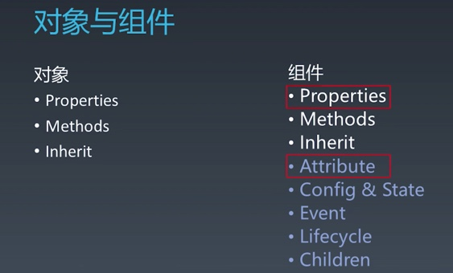
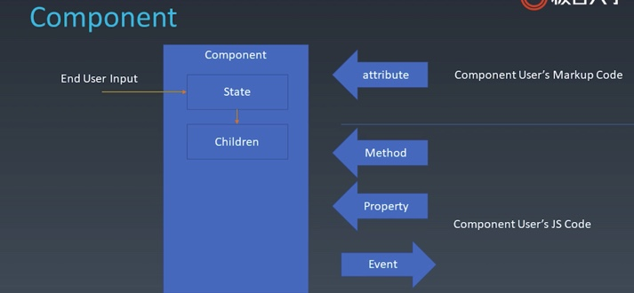
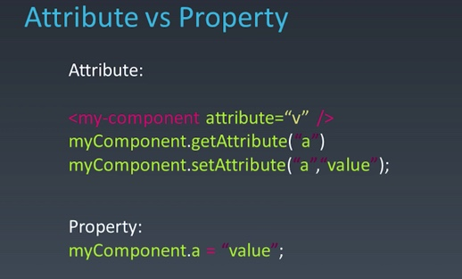
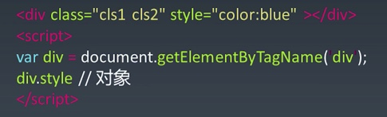
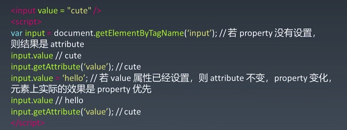
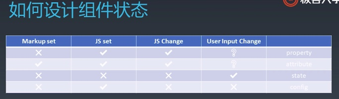
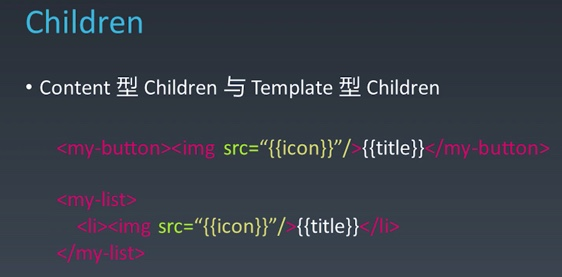

# 架构模式(前端view 和 数据逻辑层 如何交互)
 * MVC
 * MVVM
 
# 组件化
* 扩展 HTML 标签
* 目的是**复用**

好的组件化体系，提高复用率，减少心智负担。

## 组件，和 UI 强相关，可以以树形结构进行组合(children)，有一定模板化的配置能力。

组件在对象的基础上扩展了语义化的东西：

组件的各个要素：
* 终端用户
  * 通过界面进行操作，影响组件的 state，进而可以影响组件的 children
* 组件的使用者（程序员）
  * 通过 markup 标签类语言的 attribute 影响组件
  * 通过 property 影响组件 （property 与 attribute 可能是统一，取决于组件的设计）
  * method，和 property 一样，是使用组件的程序员向组件传递消息
  * event，由组件向组件的使用者传递信息

 
 ## attribute vs property
 attribute 强调描述性
 
 property 强调从属关系
 
HTML 中：

 
 
### HTML 中，二者行为上的区别：
 
早期 JS 中关键字不允许做属性名，所以 HTML 中做了妥协的设计
* attribute： class 
* property：className

二者互为反射的关系，会互相影响：

 
 
现在 JS 中可以用关键字作为属性名，`div.class` 也可以，但 HTML 中的这个设计没改。

有时候，attribute 是字符串，property 是语义化后的对象：

#### 如 **style**， 
* attribute style 是字符串；（getAttribute setAttribute）
* 而 property style 可以得到 key-value 的对象结构，更好用。

#### 再如 **href**，写 “//url-string”
* attribute href 是 HTML 原本的字符串；
* 而 property href 可以得到 resolve 过的结果，跟随当前页面 http 或 https 变化。

所以 http => https 改造需要把写死的 URL 改为 `//` 开头的。

#### 再再如 **input 的 value**
* attribute value 相当于 input 的默认值，其值不随用户的输入改变；
* 用户改的，以及input 优先显示的是 property；

区别：
* property 不能被标签改变，通过 JS 改变，大部分情况下不应该随用户输入改变
* attribute 能被标签改变，能通过 JS 改变，大部分情况下不应该随用户输入改变
* state 只能从组件内部改变
  * 一般不向组件的使用者提供改变 state 的能力，以保证 state 的一致性
  * 用户输入可以改变 state
* config 组件构造时一次性传入的结构，不可更改，通常留给全局

# 生命周期

# children
* content 型：实际上的 children，有几个渲染几个
* template 型：模板型，可通过 data 计算出多个

