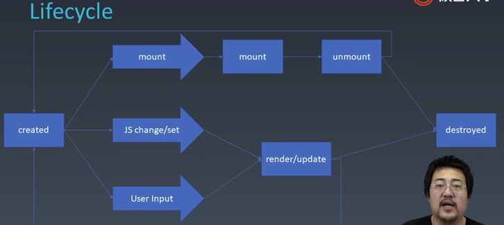

# 架构模式(前端view 和 数据逻辑层 如何交互)
 * MVC
 * MVVM
 
# 组件化
* 扩展 HTML 标签
* 目的是**复用**

好的组件化体系，提高复用率，减少心智负担。

## 组件，和 UI 强相关，可以以树形结构进行组合(children)，有一定模板化的配置能力。

组件在对象的基础上扩展了语义化的东西：


组件的各个要素：
* 终端用户
  * 通过界面进行操作，影响组件的 state，进而可以影响组件的 children
* 组件的使用者（程序员）
  * 通过 markup 标签类语言的 attribute 影响组件
  * 通过 property 影响组件 （property 与 attribute 可能是统一，取决于组件的设计）
  * method，和 property 一样，是使用组件的程序员向组件传递消息
  * event，由组件向组件的使用者传递信息


 
 ## attribute vs property
 attribute 强调描述性
 
 property 强调从属关系
 
HTML 中：

 
 
### HTML 中，二者行为上的区别：
 
早期 JS 中关键字不允许做属性名，所以 HTML 中做了妥协的设计
* attribute： class 
* property：className

二者互为反射的关系，会互相影响：

 
 
现在 JS 中可以用关键字作为属性名，`div.class` 也可以，但 HTML 中的这个设计没改。

有时候，attribute 是字符串，property 是语义化后的对象：

#### 如 **style**， 
* attribute style 是字符串；（getAttribute setAttribute）
* 而 property style 可以得到 key-value 的对象结构，更好用。


#### 再如 **href**，写 “//url-string”
* attribute href 是 HTML 原本的字符串；
* 而 property href 可以得到 resolve 过的结果，跟随当前页面 http 或 https 变化。

所以 http => https 改造需要把写死的 URL 改为 `//` 开头的。


#### 再再如 **input 的 value**
* attribute value 相当于 input 的默认值，其值不随用户的输入改变；
* 用户改的，以及input 优先显示的是 property；


区别：
* property 不能被标签改变，通过 JS 改变，大部分情况下不应该随用户输入改变
* attribute 能被标签改变，能通过 JS 改变，大部分情况下不应该随用户输入改变
* state 只能从组件内部改变
  * 一般不向组件的使用者提供改变 state 的能力，以保证 state 的一致性
  * 用户输入可以改变 state
* config 组件构造时一次性传入的结构，不可更改，通常留给全局


# 生命周期


# children
* content 型：实际上的 children，有几个渲染几个
* template 型：模板型，可通过 data 计算出多个


# 构建组件系统
## 搭建 JSX 环境
一 装包
1. `npm init`
2. `npm install -g webpack wepack-cli` (or by npx)
3. `npm install --save-dev webpack babel-loader`
4. `npm install --save-dev @babel/core @babel/preset-env`
5. `npm install --save-dev @babel/plugin-transform-react-jsx` 以支持 JSX

二 创建 `webpack.config.js`
```
module.exports = {
  entry: "./main.js",
  module: {
    rules: [
      {
        test: /\.js$/,
        use: {
          loader: "babel-loader",
          options: {
            presets: ["@babel/preset-env"],
            plugins: ["@babel/plugin-transform-react-jsx"]
          }
        }
      }
    ]
  },
  mode: "development"
}
```

webpack: 不同文件的 import require 打包到一起
babel: 把新版本的 JavaScript 翻译为 老版本


### 替换 React.createElement
```
module.exports = {
  entry: "./main.js",
  module: {
    rules: [
      {
        test: /\.js$/,
        use: {
          loader: "babel-loader",
          options: {
            presets: ["@babel/preset-env"],
            plugins: [
              ["@babel/plugin-transform-react-jsx", { pragma: 'createElement' }] // here
            ]
          }
        }
      }
    ]
  },
  mode: "development"
}
```
## JSX 本质
JSX 只不过是用 **看起来像 HTML 标签的形式** 来表示 **函数调用**。

webpack 前：
```
const a = <div id="a" />
```

webpack 后：
```
var a = createElement("div", {
  id: "aa"
});
```

### 增加 children
```
const a = <div id="aa">
  <span></span>
  <span></span>
  <span></span>
</div>

var a = createElement("div", {
    id: "aa"
  },
  // 递归调用
  createElement("span", null),
  createElement("span", null),
  createElement("span", null)
);

```

### createElement 参数列表

```
function createElement(type, attributes, ...children) {

}
```

其中的
**`type`**: 如果是 HTML tag，转为字符串；否则按变量名处理。
**`children`**: 如果 child 是文本，会直接按字符串传入，而不是递归地调用 `createElement(child, null)`，所以需要将其处理为文本节点 textNode


```
function createElement(type, attributes, ...children) {
  const element = typeof type === 'string'
    ? new ElementWrapper(type)
    : new type;

  for (const attr in attributes) {
    element.setAttribute(attr, attributes[attr]);
  }

  for (let child of children) {
    if (typeof child === 'string') {
      child = new TextNodeWrapper(child);
    }
    element.appendChild(child);
  }

  return element;
}

class Watch {
  constructor() {
    this.root = document.createElement('div');
  }
  setAttribute(name, value) {
    this.root.setAttribute(name, value);
  }
  appendChild(child) {
    this.root.appendChild(child);
  }
  mountTo(parent) {
    parent.appendChild(this.root);
  }
}

class ElementWrapper {
  constructor(type) {
    this.root = document.createElement(type);
  }
  setAttribute(name, value) {
    this.root.setAttribute(name, value);
  }
  appendChild(child) {
    // this.root.appendChild(child);
    child.mountTo(this.root);
  }
  mountTo(parent) {
    parent.appendChild(this.root);
  }
}

class TextNodeWrapper {
  constructor(type) {
    this.root = document.createTextNode(type);
  }

  mountTo(parent) {
    parent.appendChild(this.root);
  }
}

```

# 轮播图 Carousel


