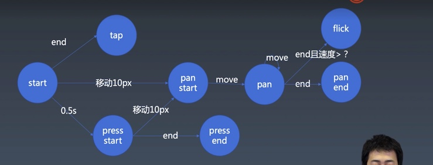

# 手势

* tap：点击
* pan：拖动（本意是移动摄像机）
  * pan start
  * pan
  * pan end 
* flick：扫动，也叫 swipe
* press：长按
  * press start
  * press end

# 触屏
touch 系列事件与 mouse 系列事件的区别：touch start 触发时，也会触发 move，而且是和 start 在同一个元素上。
所以 touch 事件的监听不需要像 mouse 一样，在 mousedown 之后才监听 mousemove
鼠标晃动的时候，可以按下键，也可以不按；而 touchmove 无法越过 touchstart 执行。
特殊的 touchcancel , touch 事件被系统事件等打断

    
evt.changedTouches 是一个list，因为会有多指

let isPan = false;
let isTap = true;
let isPress = false;
不能是全局，因为有多指触摸、鼠标左右中前进后退五个键

所以改成给 start 等方法传入参数 context

// 封装
// listen => recoginze => dispatch
// new Listener(new Recoginzer(dispatch))
